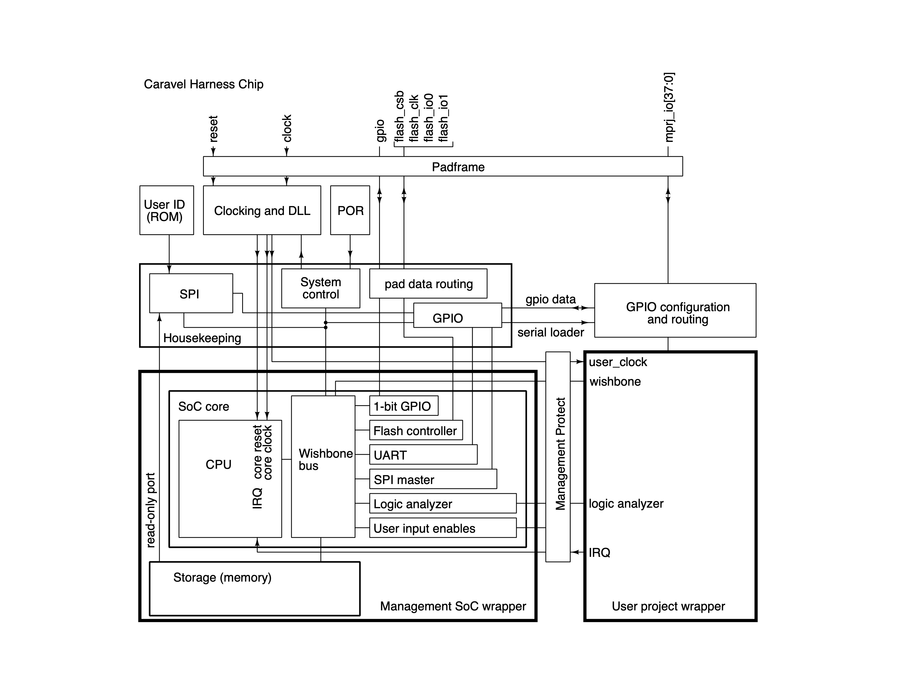

# Caravel Timer Project


## Project Overview

**Caravel** is an open-source SoC integration platform developed by Efabless that allows designers to connect their own digital/analog IP (user project) to a management SoC containing a RISC-V processor, GPIOs and Wishbone bus.

A simple **Caravel-based SoC project** built using the efabless Caravel harness, OpenLane automated RTL-to-GDSII flow and the SkyWater 130A PDK.

This project demonstrates how to integrate a custom user design into the Caravel framework and generate a manufacturable layout using fully open-source EDA tools.

The aim of the project is to implement a simple timer RTL designed by me and carry out complete RTL to Synthesis cycle using Efabless Openlane toolchain. This project is an attempt to understand the complex lifecycle development of a SoC using opensource tools.

This repository contains:
- A simple user RTL design (Timer)
- Caravel integration files
- OpenLane flow configurations
- SkyWater 130A PDK–based synthesis and PnR results
--- 




## References

- **Caravel Repository**  
  https://github.com/efabless/caravel  

- **OpenLane**  
  https://github.com/efabless/openlane  

- **SkyWater 130A PDK**  
  https://github.com/google/skywater-pdk  


## Acknowledgements

- Efabless for Caravel and OpenLane  
- Google & SkyWater for the open-source PDK  
- Open-source EDA community  

## Tools & Technologies Used

- **Caravel SoC Harness** – Efabless
- **OpenLane** – RTL to GDSII flow
- **SkyWater 130A PDK**
- **Docker**
- **Magic** – DRC
- **Netgen** – LVS
- **KLayout** – Layout viewing
- **iverilog / verilator** – RTL simulation


## 📋 Prerequisites

Ensure the following are installed:

- Docker (recommended for OpenLane)
- Git
- Linux-based environment (Ubuntu preferred)


##  Setup Instructions

### 1️. Clone this repository

```bash
git clone https://github.com/vyom-elan/Caravel_Timer.git
cd my-caravel-project
```

### 2. Install OpenLane
```bash
git clone https://github.com/efabless/openlane.git
cd openlane
make setup
```

### 3. Set Environment Variables
```bash
Copy code
export PDK_ROOT=""PDK PATH""
export PDK=sky130
```

The OpenLane configuration for the user project is located at:

```bash
openlane/designs/user_project/config.tcl
set ::env(DESIGN_NAME) user_project
set ::env(VERILOG_FILES) [glob ../../user_project/rtl/*.v]
set ::env(CLOCK_PERIOD) 10
set ::env(FP_CORE_UTIL) 50
set ::env(PL_TARGET_DENSITY) 0.60
```

Running the OpenLane Flow
```bash

cd openlane
./flow.tcl -overwrite -design user_project
```
OpenLane Outputs
Results will be generated under:

```bash
openlane/results/user_project/
```

Key outputs include - 
```bash 
gds/ – Final GDSII layout

lef/ – LEF files

reports/ – Timing, area, and power reports

signoff/ – DRC and LVS results
```
 
### Simulation & Verification

#### RTL Simulation

```bash
cd user_project/sim
make sim
```

Testbenches are located in:

```bash
user_project/tb/
```

#### Key integration files:

``` bash
caravel/rtl/user_project_wrapper.v
caravel/verilog/user_project.v          # timer RTL is instantiated in this
```

Ensure all user signals are properly mapped to Caravel IOs.

##  Project Status

| Stage         | Status        |
|--------------|---------------|
| RTL Design   | ✅ Completed  |
| Simulation   | ✅ Completed  |
| Synthesis    | ✅ Completed  |
| Place & Route| ✅ Completed  |
| DRC / LVS    | ✅ Completed  |


## Deliverables

- RTL source code  
- Synthesized netlist  
- GDSII layout  
- Timing & power reports  
- Simulation logs  


## License

This project is licensed under the **MIT License**.
